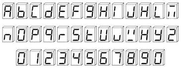

# COM1031 - Computer Logic Coursework - Morse code Encoder/Decoder

## Table of Contents
* [Project Description](#project-description)
* [Technologies](#technologies)
* [Team](#team)
* [Setup](#setup)
* [Scope of Functionality](#scope-of-functionality)
* [Logic](#logic)
* [Flowchart Information](#flowchart-information)
* [File Description](#file-description)
* [Other Information](#other-information)
* [References](#references)

## Project Description
This was a project done in the academic year 2018-2019 at the University of Surrey, for the BSc Computer Science module COM1031 - Computer Logic.

The task of this project was to write an Assembly program for an Arduino that could take Morse code input via a button, and display the corresponding letter/number on a seven-segment display.

## Technologies
This project was written in Assembly for use with and tested with the ATmega328P and an Arduino Uno.

Assembly

ATmega328P

Arduino Uno

## Team
The team consisted of four first-year Computer Science students.

Duncan Nam (me)

Matthew Reid

Nicholas Adams

Demir Eser

I took the lead role in the implementation of the 7segment.s, get-digit.s, and group-28.s files. I also produced the flowcharts to support the team in understanding.

## Setup
Connect the pins on PORTD of the Arduino Uno to the seven-segment display with the following configuration - pin 7 to the top segment, pin 1 to the upper right segment, pin 2 to lower right segment, pin 3 to the bottom segment, pin 4 to the lower left segment, pin 5 to the upper right segment, and pin 6 to the middle segment. Follow the hardware specifications to power the display correctly using the Arduino.

Connect the push button to PIN 8, PORTB Bit 0 on the Arduino Uno. This will also double as the ICP1 for the timer system. Follow the hardware specifications to do so safely.

Power the Arduino, and upload the program to the board following the software specifications.

## Scope of Functionality
This project was done as part of my undergraduate degree. Hence, the scope of this project is quite constrained. Once the setup is complete, the following functionality is expected.

* Through a combination of short presses and long presses on the button, a Morse code input can be passed into the microcontroller.
* If the input was a valid Morse character, the corresponding letter/number is displayed on the seven-segment display.
* If the input was invalid, an error character will be displayed.
* While input is being taken, the seven-segment display will show an empty character.

## Logic
The logic of this project takes advantage of the knowledge that all Morse code characters are uniquely identified by their length and sequence of dots and dashes. Additionally, registers are 16 bit and can be manipulated bitwise, particularly using logical shifts. This means that all Morse code characters can be uniquely identified programmatically via an input buffer and a count of the number of presses within a given time.

By interpreting dots as 0s and dashes as 1s, and reading the result as a binary number, a decimal value for each Morse code character can be identified. By then also counting the number of dots and dashes in each character, a set of ordered pairs can be formed as shown below.
These ordered pairs were then used to create the cascading subroutine check_letter.s, which checks the count of the input (count is stored in r25) and then the decimal value of the input (stored in r21) to identify the correct corresponding letter/number. If no corresponding combination is found, perhaps by an incorrect input, then an error character is displayed.

Each character is stored in memory as a bit pattern in [7segment.s](#7segment.s) using the below reference image.

## Flowchart Information
In the folder named Flowcharts are a set of diagrams that were produced as part of the report to depict how this system works in full.

### [check-letter-flowchart.png](./flowcharts/check-letter-flowchart.png)
This flowchart depicts how the data from the input is used to identify the corresponding letter or number.
### [group-28-flowchart-main-b.png](./flowcharts/group-28-flowchart-main-b.png)
This flowchart depicts what initial ports, timers, and interrupts are set before commencing the "infinite loop". This version of the flowchart vigorously explains how the Timer1 is configured.
### [group-28-flowchart-main.png](./flowcharts/group-28-flowchart-main.png)
This flowchart depicts what initial ports, timers, and interrupts are set before commencing the "infinite loop".
### [group-28-flowchart-timer1-compa-isr.png](./flowcharts/group-28-flowchart-timer1-compa-isr.png)
This flowchart depicts the process distinguishing between a short press and a long press, and the process of displaying the stored character on the seven-segment display. This is the compare match interrupt.
### [group-28-flowchart-timer1-cpt-isr.png](./flowcharts/group-28-flowchart-timer1-cpt-isr.png)
This flowchart depicts the process by which dots and dashes are captured and saved into the buffer, and the process determining when to clear the seven-segment display. This is the input capture interrupt.

## File Description
The main files for this project are the .s files, the source code written in Assembly.

### [7segment.s](./7segment.S)
This file defines rudimentary representations for all characters that may be displayed on the seven-segment display - numbers, letters, an empty character, and the error character.
### [check-letter.s](./check-letter.S)
This subroutine converts a Morse character (expressed in binary) and a signal count into the position of the character in the digit-table.
### [get-digit.s](./get-digit.S)
This subroutine converts a number from 0x0 to 0x25 to its digit representation on the 7-segment-display.
### [group-28.s](./group-28.S)
This is the entry point to the user code, called from init.s. The setup of ports, timer and interrupts is done here, then an eternal loop is started - with all the work done in the interrupt service routines.
This file is also where the input capture interrupt and compare match interrupt are defined. These are two interrupts on the same timer, being used to distinguish between short and long presses, and to identify the gap between letters.

## Other Information
* This project, including a report that is not attached, received a grade of 87 out of a possible 100.
* This project was completed during the academic year 2018-2019, and this repository was created and uploaded in 2022.
* The specific setup instructions is no longer available, so instructions here are minimal.

## References
Specific ATmega328P document - http://www.atmel.com/Images/Atmel-7810-Automotive-Microcontrollers-ATmega328P_Datasheet.pdf
